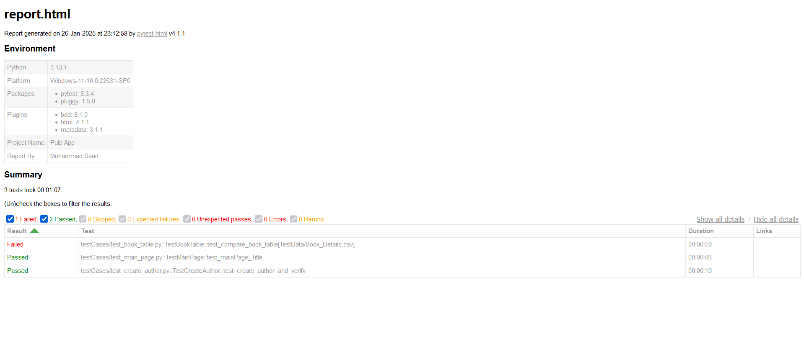

# Automation Framework Project - POM Design Pattern

This is an automation framework project for testing the Pulp GUI application using the Page Object Model (POM) design pattern. The framework is implemented using **[Selenium](https://www.selenium.dev/)** and written in **[Python](https://www.python.org/)**. 
It includes test automation for verifying book table data and adding authors, with reporting using pytest-html.

## Project Setup Instructions

1. **Clone the Repository**
   - Clone the repository to your local machine using the following command:
   ```bash
   git clone https://github.com/MuhammadSaad20/PulpAppAutomationProject.git
   ```
   
2. **Install Dependencies**
   - Navigate to the project directory:
   ```bash
   cd <project-directory>
   ```
   - Install the required dependencies using the following command:
     - For Python:
     ```bash
     pip install -r requirements.txt
     ```
    

3. **Running the Tests**
   - To run all the tests, execute the following command:
     - For Python:
     ```bash
     pytest testCases/ --browser chrome --html=reports/report.html -v -s
     ```
    

   This will run all the test cases and generate an HTML report in the `Reports/` directory.

## Test Environment Configuration

### Browser Configuration
- The framework uses **Chrome** or **firefox** as the default browser.
- Ensure that you have the correct **WebDriver** installed for the browser you intend to use (e.g., ChromeDriver for Chrome).
- The environment configuration can be customized by editing the `config.py` file.

### Reporting Configuration
- pytest-html reports are used to generate test reports. If you want to change the reporting tool, modify the reporting section in the test setup file.

### Test Data Setup
- Ensure that the **Test Data Sheet** is available and the paths are correctly set in the test scripts.
- For the "Verify Book Table Data" scenario, the data will be compared with the provided data sheet.


## Test Reports

After running the tests, the results will be available in the `Reports/` folder. Open the `report.html` file in your browser to view the detailed test results, including logs and environment details.

### Sample Report:
- **Test Log (Passed Test)**: 
   - Log for passed tests will show the success message with timestamps.
- **Test Log (Failed Test)**: 
   - Logs for failed tests will include the test name, error message, stack trace, and screenshots (if enabled).

Example screenshot from the report:




## Docker Environment Setup

The project can also be run within a Docker container for isolated environments.

### Build Docker Image

To create the Docker image for the automation framework, run the following command:
```bash
docker build --no-cache -t automation-framework .
```

### Run Tests Inside Docker Container

1. If you want to run tests directly:
   ```bash
   docker run -it automation-framework
   ```

2. If you want to run the container and enter the Node.js container:
   ```bash
   docker run -it automation-framework /bin/bash
   ```

   Then, run the following command to execute the tests inside the container:
   ```bash
   pytest testCases/ --browser chrome --html=reports/report.html -v -s
   ```

### Docker Setup Issues (Work in progress)
If Docker is not working as expected, please check the **Docker Settings** section for troubleshooting. If needed, feel free to open an issue, create a branch, and submit a pull request.

## BDD Testing (Work in progress)

For **BDD (Behavior-Driven Development)** testing, you will need to add **feature files** in the `features/` directory using the **Gherkin** syntax. This will help verify the test scenarios like "Verify Book Table Data" and "Add an Author."

### Adding Feature Files
- Create `.feature` files in the `features/` directory and write your test scenarios in Gherkin syntax.
- Example:
  ```gherkin
  Feature: Verify Book Table Data
    Scenario: Compare Book Table Data with the provided sheet
      Given the user navigates to the Pulp GUI
      When the user opens the Book Table
      Then the data should match the provided data sheet
  ```

### How to Contribute
Please feel free to pick any open issues and create a branch. Submit a pull request, and I will be happy to integrate your contributions to improve the framework, especially around BDD behavior and Docker environment setup.


### Key Updates:

- **Docker Setup**: The Docker setup is still in progress. Please refer to the open issues section for updates. 
- **BDD Support**: For extending the framework with Gherkin feature files, the BDD setup is available but not fully implemented. Feel free to contribute by picking an open issue and creating a branch for a pull request.
- **Test Reports**: The test reports will now include detailed logs of both passed and failed tests, along with the environment details.

```
